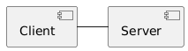
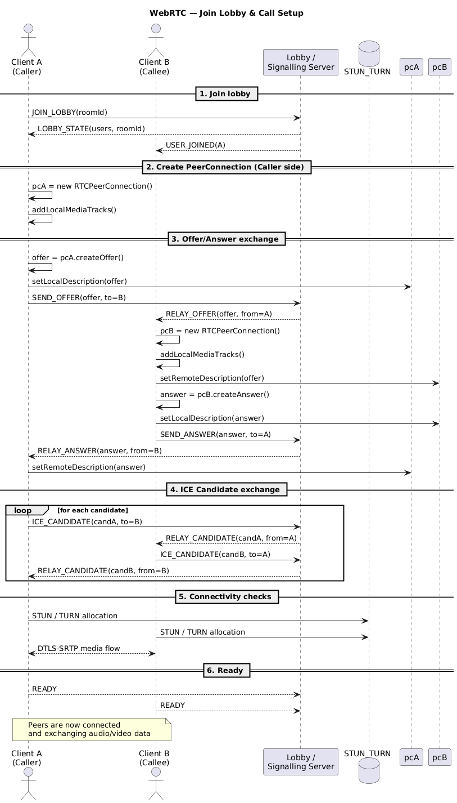
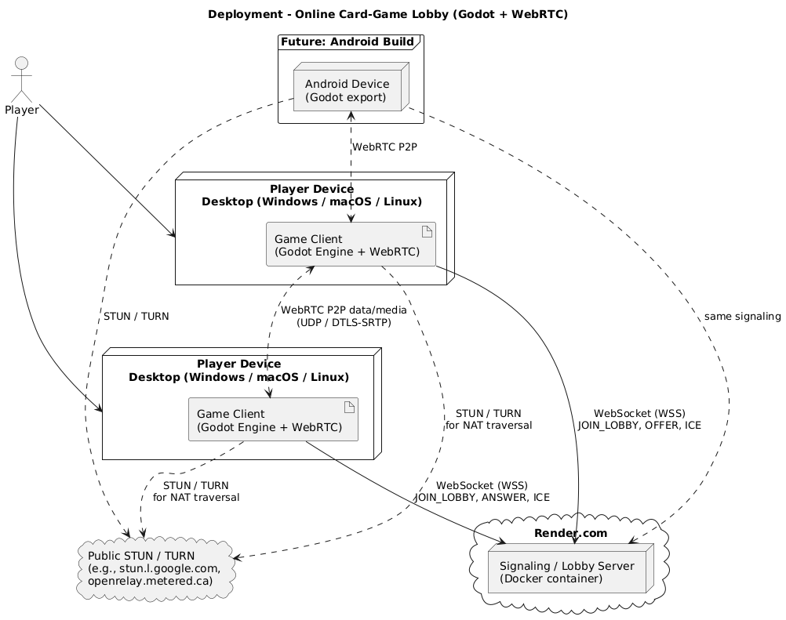

# OnlineCardGame
## Usage
The **MVP v2** is distributed as a self-contained Windows build produced by the CI pipeline.

1. Open the **Actions → _CI+CD_** workflow in GitHub and select the **latest green run**.  
2. Download the artifact **`CardGame-windows`**.  
3. Extract the ZIP archive to any local directory (no installation required).  
4. Double-click `CardGame.exe`.  
   The game will start and automatically connect to the public signalling server 

> _Advanced_: To build from source you need Go 1.24+, Godot 4.4, and the Godot export templates.  
> Run `go run ./server/cmd` to launch the signalling server and `godot --export-release "Windows Desktop"` from the **CardGame** folder to rebuild the client.

## Architecture
### Static view

| Component | Responsibility | Technology |
|-----------|----------------|------------|
| **Signalling Server** | Lobby management, player matchmaking, SDP/ICE relay | Go 1.24, WebSocket |
| **CardGame Client** | Game logic, rendering, WebRTC peer connection, UI | Godot 4.4 (GDScript) |
| **WebRTC Data Channel** | Real-time, peer-to-peer game state replication | Built-in WebRTC |

The client is logically split into Gamestate, Multiplayer layers.  
The only runtime coupling between client and server is the messages contract used during session establishment; once the peers are connected the server is out of the data path.  
This loose coupling isolates gameplay code from backend concerns, keeps the server stateless, and allows us to evolve each side independently—critical for rapid prototyping and short release cycles.

### Dynamic view

**Scenario:** _Player joins an existing lobby._

1. **UI** → **Client Core** – `joinLobby(lobbyId)`  
2. **Client Core** → **Signalling Server** – `JOIN_LOBBY` (WebSocket)  
3. **Server** → existing **Host Client** – `PEER_JOINED`  
4. **Host** ⇄ **Server** – SDP offer/answer, ICE candidates  
5. **Server** → **Joining Client** – final ICE candidate  
6. **Peer A ⇄ Peer B** – WebRTC DTLS handshake  
7. **Client Core** → **UI** – `onConnectionOpen()`

*Measured performance*  
Average time from button click to open data channel:

| Metric | Value |
|--------|-------|
| Mean | **3.0 s** |
| Tooling | `OS.get_ticks_msec()` logging on both peers |

### Deployment view

| Node | Deployed artefact | Notes |
|------|-------------------|-------|
| **Player PC** (Windows 10+) | `CardGame.exe` | Self-contained, no installer |
| **Public VPS** | `signalling-server` binary or Docker image | Requires TCP :80/443, UDP :3478 |

The game is client-heavy; only lobby orchestration traverses the internet.  
This design minimises hosting costs and latency and enables offline LAN play by swapping the signalling URL.

## Development
### Kanban board
Link: *[Board](https://github.com/orgs/OnlineCardGame-41/projects/2)*

| Column | Entry criteria |
|--------|----------------|
| **Todo** | Issue has a clear description, acceptance criteria, and is estimated. |
| **In Progress** | A developer has self-assigned the issue and created a draft branch/PR. |
| **Done** | Code merged to `main`, CI pipeline green, artefact published. |

### Git workflow

Defining rules not yet used:
   * **Branching** – short-lived topic branches from `main`:  
     `feature/123-short-slug`, `fix/456-bug-slug`.
   * **Commit messages** – .
   * **Issues & templates** – all work starts with an issue created from `feature_request.md` or `bug_report.md` (templates in `.github/ISSUE_TEMPLATE/`).
   * **Labels** – `bug`, `enhancement`.
   * **Pull requests** – one issue ↔ one PR, must reference the issue (`Fixes #123`) and use `pull_request_template.md`.
   * **Reviews & merging** – at least one approving review + green CI; squash-merge to keep history linear.
   * **Branch protection** – `main` is protected against direct pushes; administrators run emergency hotfixes via `hotfix/*` branches that follow the same PR procedure.

### Secrets management
No secrets are committed.  
The only environment-specific value—**`SIGNALLING_SERVER_URL`**—is currently hardcoded.  
Roadmap:

1. Move the address to an `.env` file read by Godot at runtime.  
2. Store the value as a **GitHub Secret** (`SIGNALLING_SERVER_URL`) and inject it into CI for automated exports. 

## Quality assurance
### Automated tests
| Layer | Tool | Test type | Location |
|-------|------|-----------|----------|
| Go server | `go test` | Unit & integration | `Server/server/tests/{unit,integration}` |
| Godot client | **GUT** | Unit & integration | `CardGame/tests/{unit,integration}` |

Static analysis:

* **gdlint / gdformat** – style and formatting for GDScript (`CardGame/scripts`).  
* **go vet / staticcheck** – code analysis for Go (`Server/server`).  

### Quality attribute scenarios
Link: *[QAS](docs/quality-assurance/quality-attribute-scenarios.md)*

## Build and deployment
### Continuous Integration
[Workflow file](.github/workflows/main.yml)

| Category | Tool | Purpose |
|----------|------|---------|
| **Static analysis** | `go vet`, `gdformat --check`, `gdlint` | Enforce code quality and style |
| **Testing** | `go test`, **GUT** | Run all unit & integration tests|
| **Packaging** | Godot exporter | Produce Windows artefact `CardGame-windows` |

All runs are visible in **GitHub Actions → CI+CD** *[CI+CD](https://github.com/OnlineCardGame-41/onlineCardGame/actions/workflows/main.yml)*.

### Continuous Deployment
The same workflow publishes the Windows build as an artefact.

Runs are tracked in the **Actions** tab *[Actions](https://github.com/OnlineCardGame-41/onlineCardGame/actions)*.
